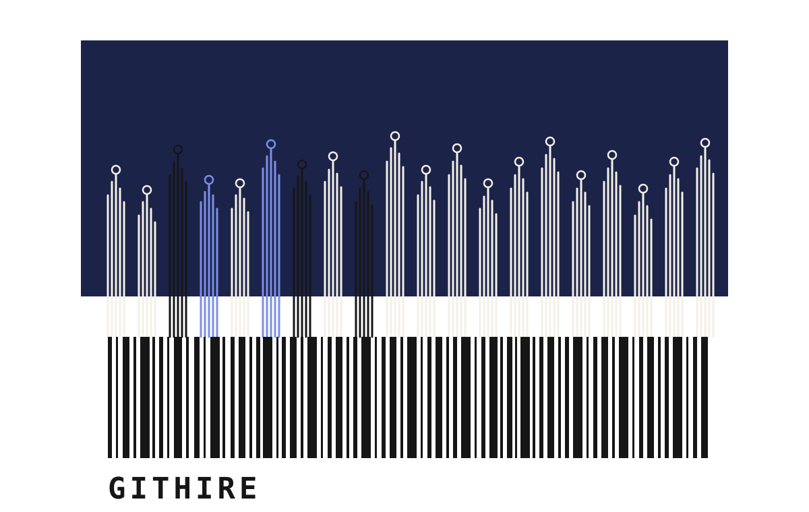
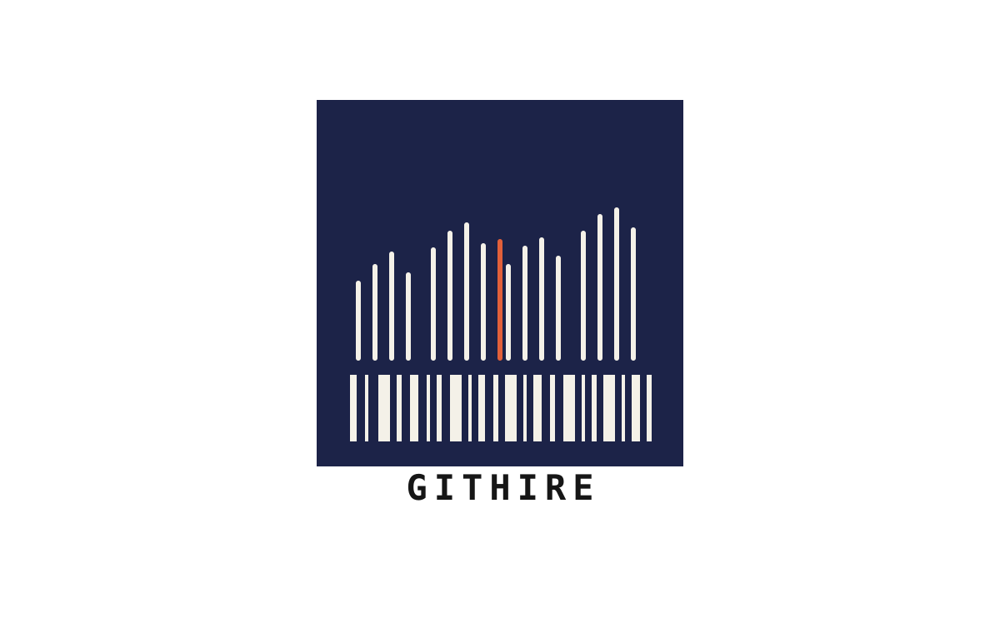
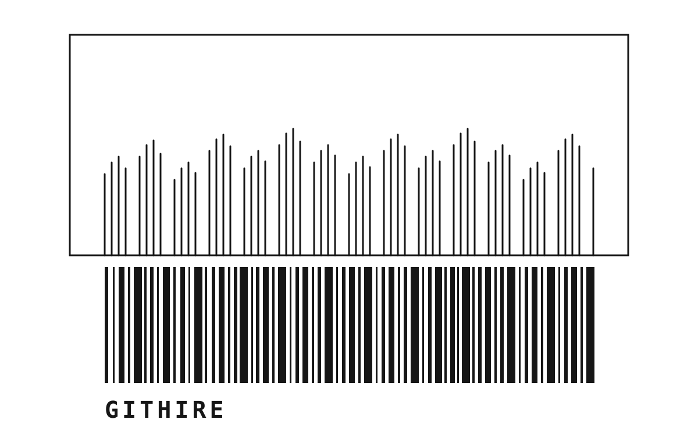

  

<h1 align="center">GitHire</h1>

  <strong>Hire and onboard through real GitHub work.</strong>

  <a href="https://realroc.github.io/git-hired/">Website</a>
  ·
  <a href="https://realroc.github.io/git-hired/blog.html">Blog</a>
  ·
  <a href="https://github.com/realRoc/git-hired/issues">Open an issue</a>

---

GitHire is a simple idea: the best way to understand how someone works is to let them work on something real.

Instead of a take-home toy problem or a vague onboarding checklist, GitHire turns hiring and onboarding into a visible path:

1. Start from a clear GitHub Issue.
2. Explore safely before touching production.
3. Ship a small real PR.
4. Review with AI and humans together.
5. Keep the decision trail for the next person.

The goal is not to test people harder. The goal is to make collaboration clearer, faster, and fairer.

## Why this exists

Modern teams already work through issues, pull requests, reviews, and release notes. GitHire treats those everyday objects as the onboarding system itself.

For candidates, it makes the work concrete.

For new teammates, it gives them context without meetings all day.

For teams, it turns hiring and onboarding into something observable, reusable, and easier to improve.

## What you can do here

This project is open for people who care about better engineering collaboration.

You are welcome to open an issue if you want to:

- suggest a better onboarding ritual;
- share a real hiring or first-PR story;
- propose a Blog topic;
- point out confusing language;
- improve the public website;
- discuss how AI agents should support, not replace, human judgment.

Issues are welcome even when they are rough. A good question is enough to start.

## Blog

The Blog is where longer notes will live:

- AI-native onboarding;
- GitHub Issue-first workflows;
- candidate experience;
- first PR stories;
- AI review and architect ownership;
- lessons from real teams.

If you want to contribute a post idea, open an issue with a short title, one paragraph of context, and any links or examples that help explain the idea.

## Brand marks

The GitHire marks used by this project live in `assets/`.

  
  

## 中文简介

展开中文说明

GitHire 的核心想法很简单：真正了解一个人的工作方式，最好让他参与一件真实的工作。

它不是传统笔试，也不是空泛的 onboarding 文档，而是把候选人或新人带入一条清晰路径：

1. 从一个清楚的 GitHub Issue 开始；
2. 先安全探索，再进入真实改动；
3. 交付一个小而真实的 PR；
4. 让 AI 和人类一起 review；
5. 把决策过程留下来，方便后来的人理解。

欢迎开发者提交 Issue：可以是问题、建议、Blog 选题、真实经历，或任何让招聘和入职更清楚、更公平的想法。

## Links

- Website: https://realroc.github.io/git-hired/
- Blog: https://realroc.github.io/git-hired/blog.html
- Issues: https://github.com/realRoc/git-hired/issues
