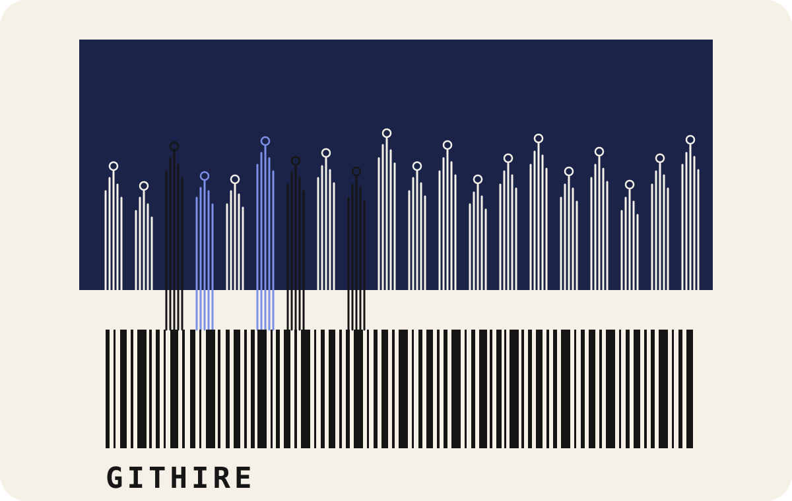

  

<h1 align="center">GitHire</h1>

  <strong>用真实的 GitHub 工作完成招聘和入职。</strong>

  <a href="README.md">English</a>
  ·
  <a href="README.zh-CN.md">中文</a>

  <a href="https://realroc.github.io/git-hired/">官网</a>
  ·
  <a href="https://realroc.github.io/git-hired/blog.html">Blog</a>
  ·
  <a href="https://github.com/realRoc/git-hired/issues">提交 Issue</a>

---

GitHire 的想法很简单：真正了解一个人的工作方式，最好让他参与一件真实的工作。

它不希望用玩具题替代真实协作，也不希望用一份很长的入职文档假装新人已经理解了团队。GitHire 把招聘和入职变成一条看得见的路径：

1. 从一个清楚的 GitHub Issue 开始。
2. 先安全探索，再进入真实改动。
3. 交付一个小而真实的 Pull Request。
4. 让 AI 和人一起 Review。
5. 把决策过程留下来，方便后来的人理解。

目标不是把考核变难，而是让协作更清楚、更快，也更公平。

## 为什么需要它

很多招聘流程让候选人在脱离真实团队的环境里表演。

很多入职流程一次性给新人太多信息，却没有帮他理解第一个真实决策。

GitHire 把这两个时刻接到团队本来就在使用的工作对象上：Issue、Pull Request、Review 和决策记录。

候选人能看到真实问题。

新人能看到一个改动如何从问题走到上线。

团队能更清楚地看到一个人如何协作。

## 欢迎你参与

这个项目欢迎所有关心工程协作、招聘体验和新人入职的人参与。

你可以提交 Issue 来：

- 建议一个更好的入职仪式；
- 分享一次真实的招聘或第一个 PR 经历；
- 提出一个 Blog 选题；
- 指出不清楚的表达；
- 改进这个公开网站；
- 讨论 AI 应该如何辅助，而不是替代人的判断。

不需要一开始就写得很完整。一个清楚的问题，就足够开始讨论。

## Blog

Blog 会用来沉淀更长的内容：

- AI-native onboarding；
- GitHub Issue-first 工作流；
- 候选人体验；
- 第一个 Pull Request 的故事；
- AI Review 和人的 Owner 意识；
- 来自真实团队的经验。

如果你有文章想法，可以开一个 Issue，写一个短标题、一段背景，以及任何有帮助的例子或链接。

## 链接

- 官网：https://realroc.github.io/git-hired/
- Blog：https://realroc.github.io/git-hired/blog.html
- Issues：https://github.com/realRoc/git-hired/issues
